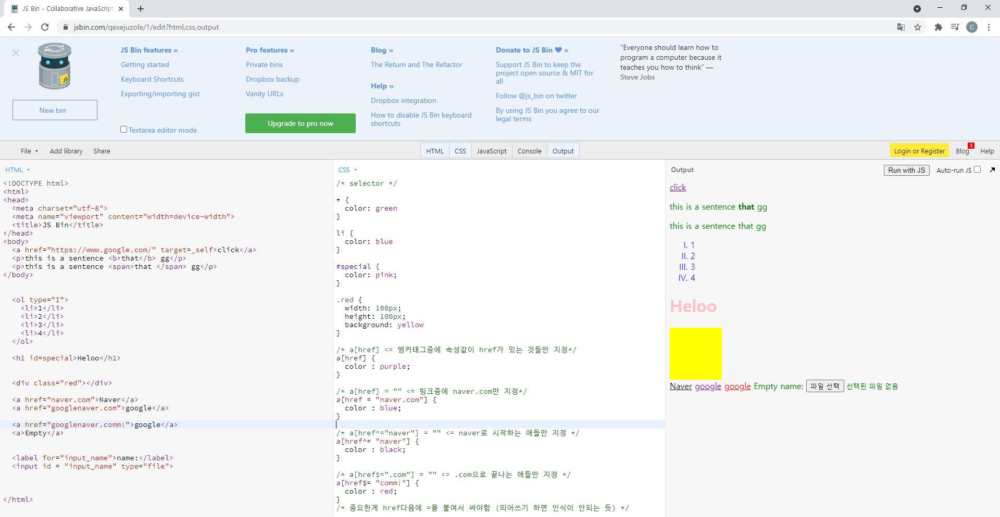

## css


- cascading
  - 폭포처럼 밑의 방향으로 우선순위가 넘어가면서 진행됨
    - 우리가 지정한거
    - 사용자가 지정한거
    - 브라우저가 지정한거
    - ** 개사기 = important ( 다 이김)


### Selector

- 게임으로 연습해보기 (https://flukeout.github.io/)
- 정답 (https://velog.io/@jaedie/CSS-Diner-%EC%99%84%EB%A3%8C%EB%8B%B5%EC%95%88%EC%9A%94%EC%A0%90%EC%A0%95%EB%A6%AC-23)


- universial selector
  - *

```python
* {
  color: green
}
```


- type selector
  - 그냥 타입을 쓰면 됨

```python
li {
  color: blue
}
```


- id selector

  - #


```python
#special {
  color: pink;
}
```


예시)

```html
<!DOCTYPE html>
<html>
<head>
  <meta charset="utf-8">
  <meta name="viewport" content="width=device-width">
  <title>JS Bin</title>
</head>
<body>
  <a href="https://www.google.com/" target=_self>click</a>
  <p>this is a sentence <b>that</b> gg</p>
  <p>this is a sentence <span>that </span> gg</p>
</body>
  

  <ol type="I">
    <li>1</li>
    <li>2</li>
    <li>3</li>
    <li>4</li>
  </ol>
  
  <h1 id=special>Heloo</h1>
  
  
  <div class="red"></div>
  
  <a href="naver.com">Naver</a>
  <a href="googlenaver.com">google</a>
  
  <a href="googlenaver.comm!">google</a>
  <a>Empty</a>
  
  
  <label for="input_name">name:</label>
  <input id = "input_name" type="file">
  
  
  
</html>
```


```css
/* selector */

* {
  color: green
}

li {
  color: blue
}

#special {
  color: pink;
}

.red {
  width: 100px;
  height: 100px;
  background: yellow
}

/* a[href] <= 앵커태그중에 속성값이 href가 있는 것들만 지정*/
a[href] {
  color : purple;
}

/* a[href] = "" <= 링크중에 naver.com만 지정*/
a[href = "naver.com"] {
  color : blue;
}

/* a[href^="naver"] = "" <= naver로 시작하는 애들만 지정 */
a[href^= "naver"] {
  color : black;
}

/* a[href$=".com"] = "" <= .com으로 끝나는 애들만 지정 */
a[href$= "comm!"] {
  color : red;
}
/* 중요한게 href다음에 =을 붙여서 써야함 (띄어쓰기 하면 인식이 안되는 듯)
```





- Descendant selector
  - 후예, 새끼라는 것

```css
# 접시속에 사과를 지목
plate apple {
}
```

