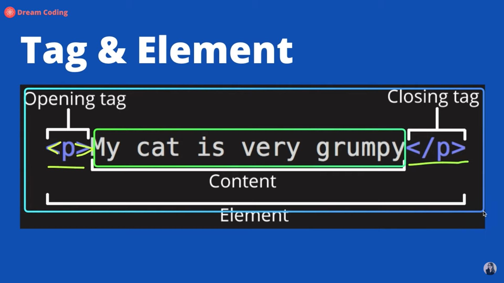
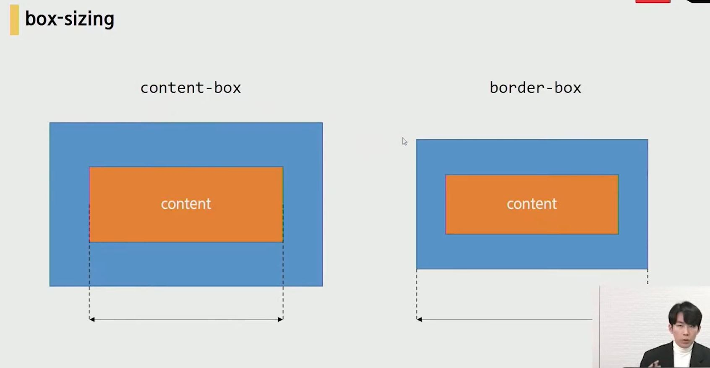

# Web 총 정리


[toc]

## HTML = 웹컨텐츠의 의미와 구조를 정의하기위해 사용하는 언어

- 기타 구조
  - title = 크롬에서 탭에 나오는 제목처럼, 이름임.
  - head = 문서 제목, 문자 코드 등 정보를 담음
    - 브라우저에 나타나지 않음.
  - body = 
  - header : 문서 전체나 섹션의 헤더 (머릿말 부분)
  - nav : 내비게이션
  - section : 문서의 일반적인 구분, 컨텐츠의 그룹을 표현
  - article : 문서,페이지,사이트 안에서 독립적으로 구분되는 영역
  - footer : 문서 전체나 섹션의 푸터(마지막 부분)


- 시맨틱 태그 : 단순히 구역을 나누는 것 뿐만아니라, '의미'를 가지는 태그들

  - non semantic 요소는 = div, span 등이 있음.
  - semantic 요소는 h1, table 등으로 볼 수 있음.

  

- form 태그 : 서버쪽으로 데이터를 보내는 역할.

  - form 태그 안의 태그들
  - input태그: 다양한 입력을 받는 태그


- 웹에 대해서 검색할때는 mdn을 뒤에 붙이면 좋음.


- tag & element
  - element
    - tag
      - opening tag
      - closing tag
    - content



## CSS

- CSS 정의 방법

  - 1. 인라인

    ```html
    <h1 style=color: blue; font-size : 100px;> </h1>
    ```

  - 2. 내부 참조 (head 안의 style태그를 이용해서)

    ```html
    <style>
        h1 {
            color: blue;
            font-size: 100px;
        }
    </style>
    ```

  - 3. 외부 참조 (다른 css 파일을 이용하여 경로 설정하여 활용)

       

- CSS 적용 우선순위

  - importance > 인라인 > id선택자 > class선택자 > 요소 선택자
  - 웬만하면 class 선택자만 쓰자! 머리 아플 필요 없이

- CSS 단위

  - em

    - 상속의 영향을 받음

  - rem

    - html 기본인 16px에 맞게 진행

    - 즉 1.5rem == 24

    - 상속의 영향을 안 받음 (그렇기 때문에 rem을 쓰길 권장)
    
      


- Box model

  - 모든 것은 다 네모임

  - 동그라미로 보이는 것도 네모를 깎아서 만든 것.

  - Box model 구성

    - Margin
      - 테두리 바깥 외부 여백
      - 쓰는 갯수에 따라 적용 되는 게 좀 다름.
        - margin: 10px;    ==  상하좌우
        - margin: 10px 20px;    ==  상하/좌우
        - margin: 10px 20px 30px;    ==  상 /좌우/ 하
        - margin: 10px 20px 30px 40px;    ==  상/ 우 / 하 / 좌 (시계방향임)
        - *margin*: 0 auto (좌우 정렬이 됨.)
    - Border
      - 테두리 영역
    - Padding
      - 테두리 안쪽 내부 영역 (테두리와 컨텐츠 안의 여백)
    - Content
      - 실제내용

  - width : 100px;로 해도 100보다 크게 됨. 왜냐면 content-box를 기준으로 100으로 만들기 때문에 --> 그렇기 때문에 box-sizing을 border-box로 설정하고, 100으로 해야하는 것임.

    ```html
        .box {
          width: 100px;
          margin: 10px auto;
          padding: 20px;
          color: white;
          background-color : blueviolet;
          box-sizing: border-box; <- 이런식으로 작성 하면 됨.
        }
    ```




- CSS Display
  - display: block
    - 줄 바꿈이 일어남
    - 화면 크기 전체의 가로 폭을 차지함.
    - 블록 레벨 요소 안에 인라인 레벨 요소가 들어갈 수 있음
  - display: inline
    - 줄 바꿈이 일어나지 않는 행의 일부 요소
    - content 너비만큼 가로폭을 차지한다.
    - witdh,height,margin-top 등을 지정할 수 없다.
    - 상하 여백은 line-height로 지정한다.
  - display: inline-block
    - block과 inline 요소의 특징을 모두 갖는다.
    - inline 처럼 한 줄에 표시 가능
    - blcok 처럼 width, heitght, margin 등 속성을 모두 지정할 수 있음.
  - 


- float

  - ex)

  ```html
  .left {
  	float: left;
  }
  
  # 이런식으로 사용 함.
  ```

  - float를 사용한 속성의 **부모속성**에 clear속성을 주어 float를 막을 수 있음.


- Flexbox

  - 배치 방향 설정
    - flex-direction ( 가로로 할거냐, 세로로할거냐)
  - 메인축 방향 정렬 (가로)
    - justify-content
      - flex-start
      - flex-end
      - center
      - space-around
      - 등등
  - 교차축 방향 정렬 (세로)
    - align-items, align-content 등
  - 요소
    - content = 여러줄
    - items= 한 줄
    - self = 하나 (개별요소)

  ```html
  # flexbox 예시
  # 0203 flexbox
  
  <!DOCTYPE html>
  <html lang="en">
  <head>
    <meta charset="UTF-8">
    <meta name="viewport" content="width=device-width, initial-scale=1.0">  
    <link rel="stylesheet" href="02_flexbox.css">
    <title>Document</title>
    <style>
  
      .flex-container {
        display: flex:
      }
      .flex-container {
        /* 정렬하려고하는 부모 요소에 선언 */
        display: flex;
        /* display: inline-flex; */
  
        /* 요소들이 강제로 한줄에 배치되게 할 것인지 여부 설정 */
        /* flex-wrap: nowrap; */
        flex-wrap: wrap;
        /* flex-wrap: wrap-reverse; */
  
        /* 메인축 방향 설정, 쌓이는 방향 설정 (메인축의 방향만 바뀜.) */
        flex-direction: row;
        /* flex-direction: row-reverse; */
        /* flex-direction: column; */
        /* flex-direction: column-reverse; */
  
        /* flex-direction과 flex-wrap의 shorthand */
        /* flex-flow: column wrap; */
  
        /* 메인축 정렬 */
        justify-content: flex-start;
        /* justify-content: flex-end; */
        /* justify-content: center; */
        /* justify-content: space-between; */
        /* justify-content: space-around; */
        /* justify-content: space-evenly; */
  
        /* 교차축 정렬 */
        /* align-items: stretch; */
        /* align-items: flex-start; */
        /* align-items: flex-end; */
        /* align-items: center; */
        /* align-items: baseline; */
      }
  
      .item1 {
        /* align-self: flex-start; */
        /* order: 0; */
        /* 주축에서 남는 공간을 항목들에게 분배 */
        /* flex-grow: 1; */
      }
  
      .item2 {
        /* align-self: center; */
        /* order: -1; */
        /* flex-grow: 2; */
      }
  
      .item3 {
        /* align-self: flex-end; */
        /* order: 1; */
        /* flex-grow: 3; */
      }
    </style>
  </head>
  <body>
    <div class="base">
      <h2>Flex</h2>
      <hr>
      <div class="box flex-container">
        <div class="item1">1</div>
        <div class="item2">2</div>
        <div class="item3">3</div>
        <!-- <div class="item4">4</div>
        <div class="item5">5</div>
        <div class="item6">6</div>
        <div class="item7">7</div>
        <div class="item8">8</div>
        <div class="item9">9</div>
        <div class="item10">10</div>
        <div class="item11">11</div>
        <div class="item12">12</div>
        <div class="item13">13</div> -->
      </div>
    </div>
  </body>
  
  </html>
  
  ```

  


## Position

**박스의 위치 속성 & 값**

- position
  - static / absolute / relative / fixed
  - z-index

<br>

**기본 개념**

1. static (기본 위치)
   - 모든 태그의 기본
   - 태그의 default 값
2. relative (상대 위치)
   - 기본 위치(static)를 기준으로 좌표 속성을 사용해 위치 이동
3. absolute (절대 위치)
   - static 이 아닌 부모/조상 요소를 기준으로 좌표 속성 만큼 이동
   - 부모 요소를 찾아가고 나아가 없다면 body에 붙는다.
4. fixed (고정 위치)
   - 부모/조상 요소와 관계없이 브라우저의 viewport를 기준으로 좌표 속성 만큼 이동
   - 스크롤을 내리거나 올려도 화면에서 사라지지 않고 항상 같은 곳에 위치

