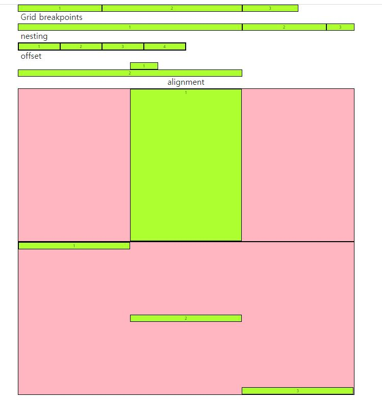

## Grid


### float

- 보통 글자들이 요소를 감싸는 형식으로 될 때만 쓰임.

```python
  <style>
    .box {
      width : 150px;
      height : 350px;
      border : 1px solid black;
      background-color: antiquewhite;
    }
    .left {
      float: left;
    }
    .right {
      float : right
    }
    .clearfix::after {
      /* 보통 clearfix로 클래스명을 지음 */
        
      content : "";
      display: block;
      clear: both;
    }
  </style>
</head>
<body>
  <header class="clearfix">
    <div class="box left">float left</div>
  </header>
  <div class="box left">float left</div>
  <div class="box right">난 오른쪽이야</div>
  <p>Lorem ipsum dolor sit amet consectetur adipisicing elit. Doloremque quasi hic consectetur iste rerum tempore. Quasi repellat quas iure! Molestiae ducimus esse est voluptatum veritatis consequatur provident? Atque, tempore quas.</p>
</body>
```


## Responsive Web Design (반응형 웹 디자인)

- 같은 컨텐츠를 봐도 각기 디바이스의 크기가 다름
- 하나의 파일로 여러가지 구동한 반응형으로 만듦
- ex) Flexbox, bootstrap Grid system


### Flexbox

- justify 메인축 정렬 (가로)
- align 교차축 정렬 (세로)


- content = 여러 줄
- items = 한줄
- self = 개별 요소 (하나)


```python
<!DOCTYPE html>
<html lang="en">
<head>
  <meta charset="UTF-8">
  <meta name="viewport" content="width=device-width, initial-scale=1.0">  
  <link rel="stylesheet" href="02_flexbox.css">
  <title>Document</title>
  <style>
    .flex-container {
      /* 정렬하려고하는 부모 요소에 선언 */
      display: flex;
      /* display: inline-flex; inline은 자기 요소만큼만 크기를 가지기 때문에, 딱 붙게됨 */

      /* 요소들이 강제로 한줄에 배치되게 할 것인지 여부 설정 */
      /* flex-wrap: nowrap; */
      flex-wrap: wrap;
      /* flex-wrap: wrap-reverse; */

      /* 메인축 방향 설정, 쌓이는 방향 설정 (메인축의 방향만 바뀜.) */
      flex-direction: row;
      /* flex-direction: row-reverse; */
      /* flex-direction: column; */
      /* flex-direction: column-reverse; */

      /* flex-direction과 flex-wrap의 shorthand */
      /* flex-flow: column wrap; */

      /* 메인축 정렬 */
      justify-content: flex-start;
      /* justify-content: flex-end; */
      /* justify-content: center; */
      /* justify-content: space-between; */
      /* justify-content: space-around; */
      /* justify-content: space-evenly; */

      /* 교차축 정렬 */
      /* align-items: stretch; */
      /* align-items: flex-start; */
      /* align-items: flex-end; */
      /* align-items: center; */
      /* align-items: baseline; */
    }


  </style>
</head>
<body>
  <div class="base">
    <h2>Flex</h2>
    <hr>
    <div class="box flex-container">
      <div class="item1">1</div>
      <div class="item2">2</div>
      <div class="item3">3</div>
      <div class="item4">4</div>
      <div class="item5">5</div>
      <div class="item6">6</div>
      <div class="item7">7</div>
      <div class="item8">8</div>
      <div class="item9">9</div>
      <div class="item10">10</div>
      <div class="item11">11</div>
      <div class="item12">12</div>
      <div class="item13">13</div>
    </div>
  </div>
</body>

</html>

```


## Grid System

예시

```python
<span class="d-block p-2 d-sm-none d-md-block bg-primary text-white">d-block</span>

# sm< <md 이라면 사라지게 됨. 
# md 이상이면 계속 block으로 나타남.
```


- **이거 왜 씀 ??** -> 반응형 웹 디자인을 하고, 예쁘게 화면 설정을 구현하기 위해서

- 12개의 column
- 6개의 grid breakpoints
  - Extra small (xs)
  - Small (sm)
  - Medium (md)
  - Large (lg)
  - Extra large (xl)
  - Extra extra large (xxl)


```python
<!DOCTYPE html>
<html lang="en">
<head>
  <meta charset="UTF-8">
  <meta name="viewport" content="width=device-width, initial-scale=1.0">
  <link href="https://cdn.jsdelivr.net/npm/bootstrap@5.0.0-beta1/dist/css/bootstrap.min.css" rel="stylesheet" integrity="sha384-giJF6kkoqNQ00vy+HMDP7azOuL0xtbfIcaT9wjKHr8RbDVddVHyTfAAsrekwKmP1" crossorigin="anonymous">  <title>Document</title>
  <style>
    body {
      height: 3000px;
    }

    .box {
      background-color:greenyellow;
      border: 1px solid black;
      text-align: center;
    }

    .parent {
      border: 1px solid black;
      height: 600px;
      background-color:lightpink;

    }
  </style>
</head>
<body>
  <div class="container">
    <div class="row">
      <div class="col-3 box">1</div>
      <div class="col-5 box">2</div>
      <div class="col-2 box">3</div>
    </div>


    <h2>Grid breakpoints</h2>
    <div class="row">
      <div class="box col-2 col-sm-8">1</div>
      <div class="box col-8 col-sm-3">2</div>
      <div class="box col-2 col-sm-1">3</div>
    </div>

    <!-- 안에서 쪼개기 -->
    <h2>nesting</h2> 
    <div class="row">
      <div class="box col-6">
        <div class="row">
          <div class="box col-3">1</div>
          <div class="box col-3">2</div>
          <div class="box col-3">3</div>
          <div class="box col-3">4</div>
        </div>
      </div>
    </div>

    <!-- 시작하는 지점 정하기-->
    <h2>offset</h2>
    <div class="row">
      <div class="box col-1 offset-4">1</div>
      <div class="box col-8">2</div>
    </div>

    
    <flexbox 사용>
    <h2 class="text-center">alignment</h2>
    <div class="row parent justify-content-center">
      <div class="box col-4">1</div>
    </div>

    <div class="row parent justify-content">
      <div class="box col-4 align-self-start">1</div>
      <div class="box col-4 align-self-center">2</div>
      <div class="box col-4 align-self-end">3</div>
    </div>

  </div>


  <script src="https://cdn.jsdelivr.net/npm/bootstrap@5.0.0-beta1/dist/js/bootstrap.bundle.min.js" integrity="sha384-ygbV9kiqUc6oa4msXn9868pTtWMgiQaeYH7/t7LECLbyPA2x65Kgf80OJFdroafW" crossorigin="anonymous"></script>
</body>
</html>

```


- container 있어야 양옆에 여백을 좀 둔 상태로 가운데로 잡아줌. 내부적으로 있는 기능임





